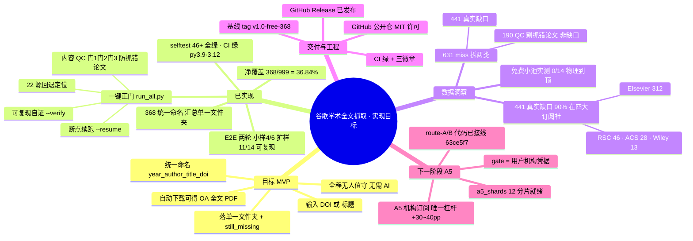

# 思维导图 · 本项目实现目标达成（368 基线）

> -157（总指挥）｜2026-07-04｜基于 `out/coverage.json`（368/631/36.84%）+ 交付终验收 + 失败统计 + A5 路线图。GitHub 可直接渲染下方 Mermaid。

## 一句话读图

- **左：目标**——一键把 DOI/标题变成统一命名的 OA 全文，无人值守。
- **上：已实现**——工具 + 净覆盖 368/36.84% + 两轮可复现 E2E + 全绿质量门 + 单一文件夹交付。
- **右：数据洞察**——631 缺口里 190 是「抓错论文」已剔（非缺口），441 真缺口九成是四大社付费墙；免费路线实测 0/14 到顶。
- **下：交付/下一阶段**——已专业化公开备份（MIT/CI/tag/Release）；再上台阶唯一靠 A5 机构订阅（分片与代码就绪，只等凭据）。

---

*思维导图 2026-07-04｜-157｜368 基线达成图｜Mermaid mindmap（GitHub 原生渲染）。*
