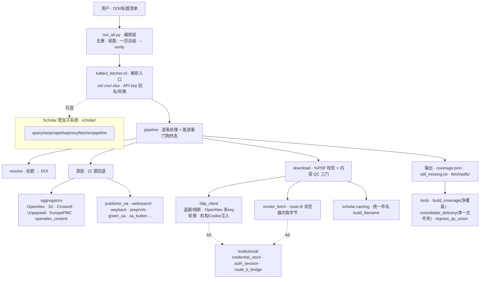

# 架构图 · 源与模块层次（fulltext_fetcher）

> -157（总指挥）｜2026-07-04｜编排层 → 管线 → 源层(22) → 下载/QC → A5 机构订阅 → 输出/工具。GitHub 可直接渲染下方 Mermaid。

## 分层读图

1. **编排层** `run_all.py`：一条命令统管去重、续跑、终态汇总、可复现自证。
2. **入口/管线** `cli` → `pipeline`：解析输入、逐条驱动、尾部看门狗保证每条有终态。
3. **源层（22 源回退）** `sources/*`：OA-API + 出版商 OA + websearch 兜底 + OpenAlex Content（多 key）。
4. **下载 + 内容 QC** `download`：字节校验 + 三门（防抓错论文）；`http_client` 管退避/熔断/多 key/机构注入；`render_fetch` 走 route-B。
5. **A5 机构订阅** `institutional`：凭据存储 + 会话 + route-B 注入桥（唯一 gate = 用户凭据）。
6. **输出与工具** `coverage.json`/`still_missing.txt`/`pdfs/` + `tools`（净覆盖构建、单一文件夹汇总、QC 回归）。
7. **Scholar 子系统** `scholar/`：可选的谷歌学术爬虫（query/serp/captcha/proxy/fetcher/naming/pipeline）。

---

*架构图 2026-07-04｜-157｜fulltext_fetcher 源与模块层次｜Mermaid graph（GitHub 原生渲染）。*
