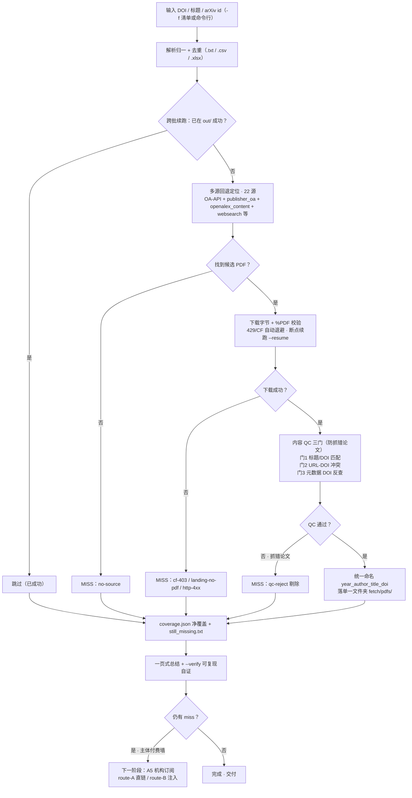

# 流程图 · 一键正门功能步骤（run_all.py 管线）

> -157（总指挥）｜2026-07-04｜`python run_all.py -f <清单> -o <RUNROOT>` 的端到端处理流程。GitHub 可直接渲染下方 Mermaid。

## 读图要点

- **主干**：输入 → 去重 → 多源定位 → 下载+校验 → **内容 QC 三门** → 统一命名落单一文件夹 → coverage/still_missing → 一页总结 + `--verify`。
- **三处 MISS 出口**都有明确终态：`no-source`（无候选）、下载失败（`cf-403`/`landing`/`http-4xx`）、`qc-reject`（抓错论文被剔）。
- **内容 QC 三门**是「诚实净覆盖」的关键：宁可判 miss 也不放行抓错论文（门3 meta-doi-mismatch 专拦「同题他刊」）。
- **续跑闭环**：`still_missing.txt` 可直接作下一轮 `-f` 输入；付费墙主体交 A5 阶段。

---

*流程图 2026-07-04｜-157｜run_all.py 端到端管线｜Mermaid flowchart（GitHub 原生渲染）。*
